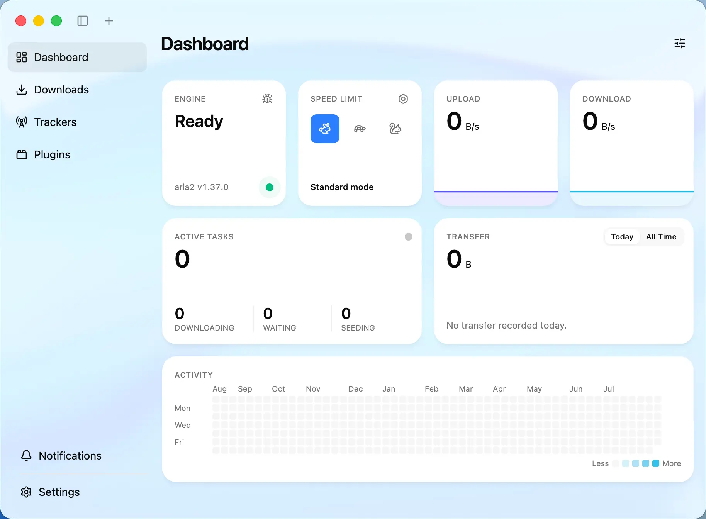
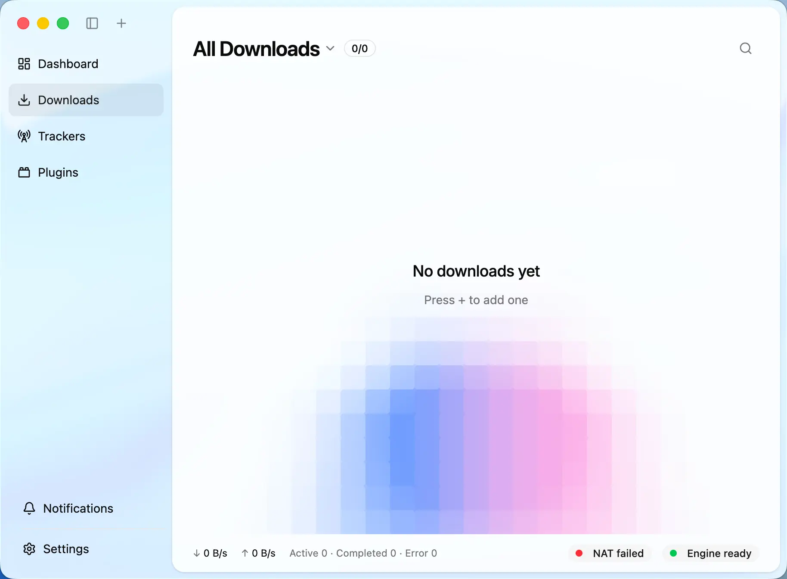
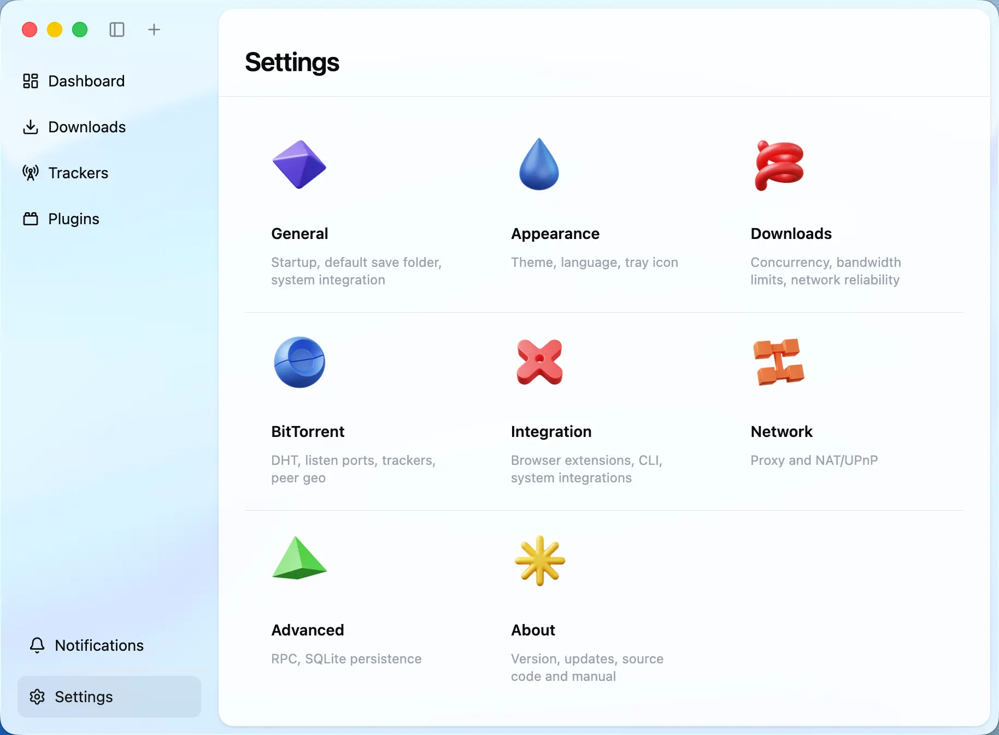

<div>
  
  <h1>Motrix</h1>
  <p>A modern, full-featured download manager that stays simple to use</p>
</div>

[](https://github.com/agalwood/Motrix/releases)  

English | [简体中文](./README.zh-CN.md)

## Overview

Motrix is a clean, full-featured desktop download manager for HTTP, FTP, BitTorrent, magnet links, and more.

**Motrix Turbo** is Motrix v2, rebuilt from the ground up with Electron, React, and TypeScript while keeping the clean, straightforward experience of v1. The download core is independent of the UI. Browser extensions and command-line tools communicate with the app over **MDXP** (Motrix Download eXchange Protocol), an open protocol built on JSON-RPC 2.0, while plugins run in isolated sandboxes.

The same core powers two ways to run Motrix:

- **Desktop app:** Runs on macOS, Windows, and Linux
- **Headless server:** Runs without a desktop environment, either directly on Node.js or in Docker, and includes a web UI for NAS devices and home servers

## 🧪 Beta testing

Motrix Turbo v2 is currently in beta. After its remaining release gates pass,
download [v2.0.0-beta.16 from GitHub Releases](https://github.com/agalwood/Motrix/releases/tag/v2.0.0-beta.16)
and read the [full release notes](./docs/release-notes/2.0.0-beta.16.md) before
installing it.

Back up your existing Motrix data and downloads before testing. Migration from
Motrix v1 data has not yet been validated, so do not use your only copy of v1
data with this beta. When practical, test v2 in parallel using a separate OS
account, machine, or Docker data directory.

## Screenshots

### Dashboard

<picture>
  <source media="(prefers-color-scheme: dark)" srcset="./screenshots/motrix-dashboard-dark.webp">
  <source media="(prefers-color-scheme: light)" srcset="./screenshots/motrix-dashboard.webp">
  
</picture>

### Downloads

<picture>
  <source media="(prefers-color-scheme: dark)" srcset="./screenshots/motrix-downloads-dark.webp">
  <source media="(prefers-color-scheme: light)" srcset="./screenshots/motrix-downloads.webp">
  
</picture>

### Settings

<picture>
  <source media="(prefers-color-scheme: dark)" srcset="./screenshots/motrix-settings-dark.webp">
  <source media="(prefers-color-scheme: light)" srcset="./screenshots/motrix-settings.webp">
  
</picture>

## ✨ Features

- 🕹 Clean, intuitive interface with dark mode
- 🦄 BitTorrent downloads with per-file selection, plus magnet link support
- 📡 Built-in tracker list management with automatic updates and health checks
- 🔌 UPnP and NAT-PMP port mapping
- 🚥 Upload and download limits with multiple speed-limit profiles
- 💾 SQLite-backed sessions that restore downloads after a restart
- 📊 Customizable Dashboard with transfer stats, live activity, and task tiles
- 🔔 System notifications when downloads finish, plus an in-app notification center
- 🧩 QuickJS-based plugin sandboxing, fine-grained permissions, and an in-app marketplace
- 🌐 Chrome and Firefox extensions that hand browser downloads off to Motrix in one click
- ⌨️ Official `@motrix/cli` client for everyday shell use and AI agents
- 🐳 Docker-ready headless server with secure device-code pairing for remote CLI and agent clients
- 🎬 Extensible URL Resolver plugins for extracting media from supported sites
- 🤖 System tray integration and launch at startup
- 🌍 Simplified Chinese and English UI, with more languages planned
- 🔗 Handlers for `motrix://` and `magnet:` links, plus `.torrent` file associations

## 🧩 Ecosystem

Motrix extends beyond the desktop app with a shared protocol library, command-line client, browser extensions, and a complete plugin toolchain:

| Project | Distribution | What it does |
|---------|--------------|--------------|
| [`@motrix/mdxp`](https://github.com/motrixapp/mdxp) | npm package | Defines the shared JSON-RPC 2.0 wire schemas and Zod types for MDXP, with helpers for bidirectional connections |
| [`@motrix/cli`](https://github.com/motrixapp/cli) | npm package | Provides the `motrix` command, automatically discovers a local desktop app, and pairs with remote instances |
| Motrix Browser Extension | Browser extension | Intercepts downloads in Chrome and Firefox (Manifest V3), hands them off to Motrix, and pairs securely with the desktop app over native messaging |
| Motrix Plugin SDK | Four npm packages | Includes `@motrix/plugin-manifest-schema`, `@motrix/plugin-api`, `@motrix/plugin-cli`, and `create-motrix-plugin` for developing, testing, and packaging plugins |
| [Builtin Plugins](https://github.com/motrixapp/builtin-plugins) | Signed `.moext` packages | Includes three official plugins: **Filename Template** for renaming files from a template before they are saved, **Page Scraper** for extracting direct file links from HTML pages, and **URL Resolver** as the foundation for site-specific media resolution |
| Plugin Registry | Public JSON feed | Publishes plugin listings and install metadata at `dl.motrix.app/registry/plugins.json` for both the website and the in-app marketplace |

### CLI quick start

```bash
npm install -g @motrix/cli    # Requires Node.js 22 or later

motrix add https://example.com/file.iso --save-dir ~/Downloads
motrix list                   # List downloads
motrix watch --stats          # Stream live progress as NDJSON
motrix pair --name my-nas     # Pair with a remote or headless instance
```

### Build a plugin

```bash
pnpm create motrix-plugin my-plugin
```

Plugins run inside a QuickJS sandbox. Each plugin declares the host capabilities it needs in its manifest, such as notifications, secret storage, or FFmpeg detection. Motrix asks the user before granting access. See the Plugin SDK documentation for development workflows, starter templates, packaging, and publishing.

## 📦 Installation

### Desktop app

Download Motrix from [motrix.app](https://motrix.app) and choose the package for your operating system. Most Mac users should choose the Apple Silicon build; Intel builds are available for older Macs with Intel processors.

After the remaining release gates pass, the current beta desktop packages
will be distributed through the GitHub prerelease linked above. Snap is not
published for this beta; prerelease tag runs stop after source validation and
do not build or publish Snap artifacts. Choose the package that matches your
operating system and architecture:

| Platform | Architectures | Packages / channel | Recommendation |
|----------|---------------|--------------------|----------------|
| macOS 12+ | `arm64` (Apple Silicon), `x64` (Intel) | `.dmg` / `.zip` | Use the `.dmg` matching your Mac; choose `x64` only for an Intel-based Mac |
| Windows | `x64` | `.exe` (NSIS installer) / `.zip` | Use the `.exe` installer for a normal installation or `.zip` for a manually extracted copy |
| Linux | `x64`, `arm64` | `.deb` / `.rpm` | Use `.deb` on Debian or Ubuntu, or `.rpm` on Fedora or openSUSE |

This beta does not publish an AppImage or Snap. Flatpak is validated separately
and is not published by the release tag. Windows `arm64` and all 32-bit
packages are not available. Windows `x64` packages are unsigned and may
trigger a Windows SmartScreen warning.

### Command-line client

```bash
npm install -g @motrix/cli
```

You can also install it from Settings → Integration → Command-line tools in the desktop app.

### Headless server with Docker

Tagged releases publish a multi-architecture Server image to Docker Hub and
GHCR. Beta releases publish only the immutable version tag and do not update
`latest`; the included `compose.yaml` keeps Server state separate from
downloaded resources:

```bash
mkdir -p motrix-data downloads
sudo chown 1000:1000 motrix-data downloads
export MOTRIX_IMAGE='docker.io/motrixapp/motrix-server:2.0.0-beta.16'
export MOTRIX_PUBLIC_URL='http://nas.example.lan:8080'
docker compose pull server
docker compose up -d --wait
```

The runtime is non-root, supports a read-only root filesystem, validates mount
permissions before accepting work, and preserves downloads, sessions, and
installed plugins across container replacement. The standard direct-LAN setup
publishes the Web service on port 8080 and MDXP on port 16801. Set
`MOTRIX_PUBLIC_URL` to the Web approval URL that remote clients can actually
reach; the Compose files do not substitute a misleading localhost URL.

If the Web approval URL is temporarily unavailable, an SSH operator can list
and approve the exact client code without exposing another port:

```bash
docker compose exec server motrix-admin pairing pending
docker compose exec server motrix-admin pairing approve ABCD-EFGH
```

Remote CLI and agent clients pair through the device-code flow. Browser
extensions pair with the desktop app through native messaging; first-time
extension pairing is not provided by the headless server. Direct HTTP is
appropriate only on a trusted LAN. Internet or untrusted-LAN access requires a
TLS reverse proxy and firewall rules around the origin ports. See the
[Docker Server deployment guide](./docs/docker-server.md) for ownership setup,
Docker Hub/GHCR image and tag selection, DSM 7 and fnOS installation, ports,
diagnostics, and backup/upgrade instructions.

## 🛠 Development

Development requires Node.js 22 or later and pnpm. Use the pnpm version specified by the `packageManager` field in `package.json`.

```bash
git clone https://github.com/agalwood/Motrix.git
cd Motrix

pnpm install     # Install dependencies, download aria2 for your platform, and rebuild native modules
pnpm start       # Start the Electron app in development mode with Vite HMR in the renderer

pnpm test        # Run the Vitest unit tests
pnpm test:e2e    # Run the Playwright E2E tests
pnpm run lint    # Run Biome checks

pnpm build       # Fetch signed built-in plugins, then build the native host and four Vite targets
```

### Preview the in-window application menu on macOS

Windows and Linux render the application menu inside the Motrix window. To
preview that chrome while developing on macOS, start the app with the preview
flag enabled:

```bash
MOTRIX_PREVIEW_MAC_MENU=1 pnpm start
```

The flag hides the main window's macOS traffic-light buttons and enables the
renderer dropdown menu. Restart the development process after changing the
flag because both Electron and Vite read it at startup.

This mode is intended for layout and command-item debugging. Electron routes
macOS role items through AppKit's native menu, so role-backed actions such as
**Window → Minimize** do not behave identically when invoked from the preview
dropdown. Validate those native role actions on Windows or Linux.

See the scripts in `package.json` for the available packaging commands. Platform-specific settings for macOS, Windows, and Linux live in `electron-builder.json`.

## 🔧 Tech stack

| Area | Stack |
|------|-------|
| Desktop shell | Electron 43 |
| UI | React 19 + Tailwind CSS 4 + shadcn/ui |
| Language | TypeScript in strict mode |
| Build system | Vite 8 with separate main, preload, worker, and renderer targets |
| Validation | Zod 4 for settings, IPC payloads, and wire schemas |
| Download engine | A Motrix-maintained fork of [aria2](https://github.com/motrixapp/aria2), bundled with the app |
| Persistence | better-sqlite3 for download session storage and recovery |
| Plugin sandbox | quickjs-emscripten |
| Server runtime | Node.js + Fastify + WebSocket |
| Internationalization | i18next + react-i18next |
| Quality tooling | Biome, Vitest, and Playwright |

The codebase has four strict layers. CI enforces the dependency boundaries between them, keeping the core portable and leaving a clear path for a future Rust rewrite:

```
renderer (React UI)
   │  IPC via window.motrix
app core (tasks, settings, plugins, bridge)
   │
engine adapter
   │
aria2 (download engine)
```

The Electron desktop app and the Node.js headless server share the same core. Platform-specific capabilities such as notifications and secret storage have separate implementations with consistent behavior.

## 📜 License

[MIT](./LICENSE) © 2018-present Dr_rOot

See [`THIRD_PARTY_NOTICES.md`](./THIRD_PARTY_NOTICES.md) for third-party license information.
Release packages also include a generated dependency inventory, consolidated license texts, and an SPDX 2.3 SBOM under `legal/`.
