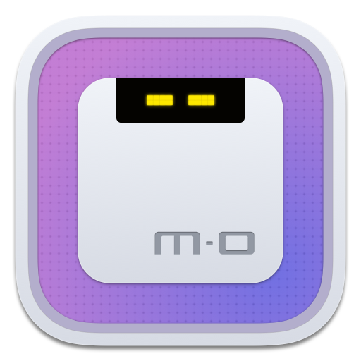

# Motrix

<a href="https://motrix.app">
  
</a>

## A full-featured download manager

[](https://github.com/agalwood/Motrix/releases)   

English | [简体中文](./README-CN.md)

Motrix is a full-featured download manager that supports downloading HTTP, FTP, BitTorrent, Magnet, etc.

Motrix has a clean and easy to use interface. I hope you will like it 👻.

✈️ [Official Website](https://motrix.app) | 📖 [Manual](https://github.com/agalwood/Motrix/wiki)

## 💽 Installation

Download from [GitHub Releases](https://github.com/agalwood/Motrix/releases) and install it.

### Windows

It is recommended to install Motrix using the installation package (Motrix-Setup-x.y.z.exe) to ensure a complete experience, such as associating torrent files, capturing magnet links, etc.

If you prefer the portable version, you can use [scoop](https://github.com/lukesampson/scoop) (need Windows 7+) to install Motrix.

```bash
scoop bucket add extras
scoop install motrix
```

### macOS

The macOS users can install Motrix using `brew cask`, thanks to [PR](https://github.com/Homebrew/homebrew-cask/pull/59494) of [Mitscherlich](https://github.com/Mitscherlich).

```bash
brew update && brew install --cask motrix
```

### Linux

You can download the `AppImage` (for all Linux distributions) or `snap` to install Motrix, see [GitHub/release](https://github.com/agalwood/Motrix/releases) for more Linux installation package formats.

If you want to build from source code, please read the **Build** section.

#### AppImage
The latest version of Motrix AppImage requires you to manually perform desktop integration. Please check the documentation of [AppImageLauncher](https://github.com/TheAssassin/AppImageLauncher) .

> Desktop Integration
> Since electron-builder 21 desktop integration is not a part of produced AppImage file.
> [AppImageLauncher](https://github.com/TheAssassin/AppImageLauncher) is the recommended way to integrate AppImages.

Deepin 20 Beta users failed to install Motrix, please follow the steps below:

Open the `Terminal`, paste and run the following command to install Motrix again.

```bash
sudo apt --fix-broken install
```

#### Snap
Motrix has been listed on [Snapcraft](https://snapcraft.io/motrix) , Ubuntu users recommend downloading from the Snap Store.

Tips for v1.5.10

The tray may not display the indicator normally, which makes it inconvenient to exit the application.

Please unchecked Preferences--Basic Settings--Hide App Menu (Windows & Linux Only), click Save & Apply. Then click "Exit" in the File menu to exit the application.

Please update to v1.5.12 and above, you can use the keyboard shortcut <kbd>Ctrl</kbd> + <kbd>q</kbd> to quickly exit the application.

#### AUR
For Arch Linux users, Motrix is available in [aur](https://aur.archlinux.org/packages/motrix/), thanks to the maintainer [weearc](https://github.com/weearc).

Run the following command to install:

```bash
yay motrix
```

Motrix may need to run with `sudo` for the first time in Linux because there is no permission to create the download session file (`/var/cache/aria2.session`).

## ✨ Features

- 🕹 Simple and clear user interface
- 🦄 Supports BitTorrent & Magnet
- ☑️ BitTorrent selective download
- 📡 Update tracker list every day automatically
- 🔌 UPnP & NAT-PMP Port Mapping
- 🎛 Up to 10 concurrent download tasks
- 🚀 Supports 64 threads in a single task
- 🚥 Supports speed limit
- 🕶 Mock User-Agent
- 🔔 Download completed Notification
- 💻 Ready for Touch Bar (Mac only)
- 🤖 Resident system tray for quick operation
- 🌑 Dark mode
- 🗑 Delete related files when removing tasks (optional)
- 🌍 I18n, [View supported languages](#-internationalization).
- 🛠 More features in development

## 🖥 User Interface


## ⌨️ Development

### Clone Code

```bash
git clone git@github.com:agalwood/Motrix.git
```

### Install Dependencies

```bash
cd Motrix
yarn
```

> Error: Electron failed to install correctly, please delete node_modules/electron and try installing again

`Electron` failed to install correctly, please refer to https://github.com/electron/electron/issues/8466#issuecomment-571425574

### Dev Mode

```bash
yarn run dev
```

### Build Release

```bash
yarn run build
```

After building, the application will be found in the project's `release` directory.

## 🛠 Technology Stack

- [Electron](https://electronjs.org/)
- [Vue](https://vuejs.org/) + [VueX](https://vuex.vuejs.org/) + [Element](https://element.eleme.io)
- [Aria2](https://aria2.github.io/) (Note: macOS and Linux versions use 64-bit aria2c, Windows version uses 32-bit)

## ☑️ TODO

Development Roadmap see: [Trello](https://trello.com/b/qNUzA0bv/motrix)

## 🤠Contribute [](http://makeapullrequest.com)

If you are interested in participating in joint development, PR and Forks are welcome!

## 🌍 Internationalization

Translations into versions for other languages are welcome 🧐! Please read the [translation guide](./CONTRIBUTING.md#-translation-guide) before starting translations.

| Key   | Name                | Status       |
|-------|:--------------------|:-------------|
| ar    | Arabic            |    [@hadialqattan](https://github.com/hadialqattan) |
| bg    | Българският език    | ✔️ [@null-none](https://github.com/null-none) |
| ca    | Català              | ✔️ [@marcizhu](https://github.com/marcizhu) |
| de    | Deutsch             | ✔️ [@Schloemicher](https://github.com/Schloemicher) |
| el    | Ελληνικά            |    [@Likecinema](https://github.com/Likecinema) |
| en-US | English             | ✔️           |
| es    | Español             | ✔️ [@Chofito](https://github.com/Chofito)|
| fa    | فارسی               | ✔️ [@Nima-Ra](https://github.com/Nima-Ra) |
| fr    | Français            | ✔️ [@gpatarin](https://github.com/gpatarin) |
| hu    | Hungarian           |     [@zalnaRs](https://github.com/zalnaRs) |
| id    | Indonesia           | ✔️ [@aarestu](https://github.com/aarestu) |
| it    | Italiano            |    [@blackcat-917](https://github.com/blackcat-917) |
| ja    | 日本語               | ✔️ [@hbkrkzk](https://github.com/hbkrkzk) |
| ko    | 한국어                | ✔️ [@KOZ39](https://github.com/KOZ39) |
| pl    | Polski              |     [@KanarekLife](https://github.com/KanarekLife) |
| pt-BR | Portuguese (Brazil) | ✔️ [@andrenoberto](https://github.com/andrenoberto) |
| ro    | Română             | ✔️ [@alyn3d](https://github.com/alyn3d) |
| ru    | Русский             | ✔️ [@bladeaweb](https://github.com/bladeaweb) |
| tr    | Türkçe              | ✔️ [@abdullah](https://github.com/abdullah) |
| uk    | Українська          | ✔️ [@bladeaweb](https://github.com/bladeaweb) |
| vi    | Tiếng Việt          | ✔️ [@duythanhvn](https://github.com/duythanhvn) |
| zh-CN | 简体中文             | ✔️           |
| zh-TW | 繁體中文             | ✔️ [@Yukaii](https://github.com/Yukaii) |

## 📜 License

[MIT](https://opensource.org/licenses/MIT) Copyright (c) 2018-present Dr_rOot
