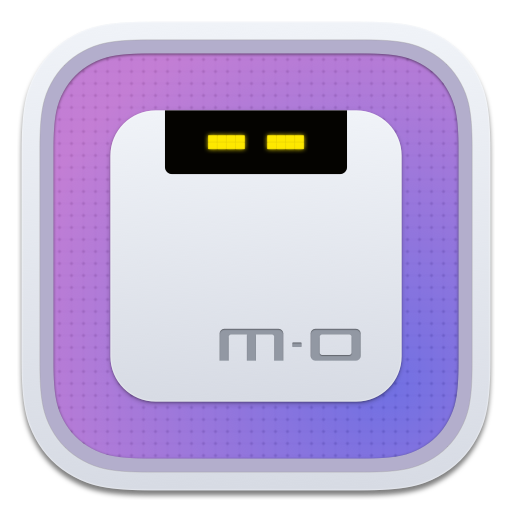
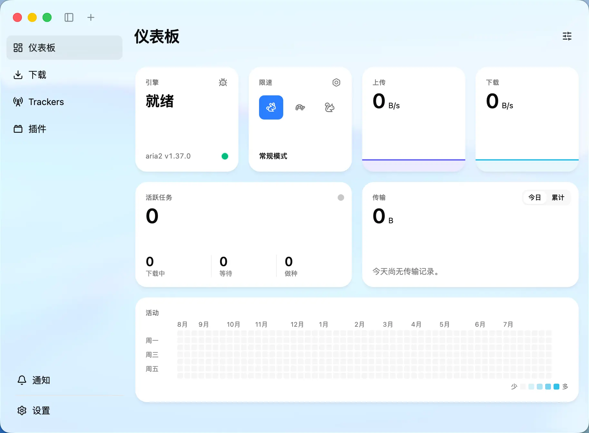
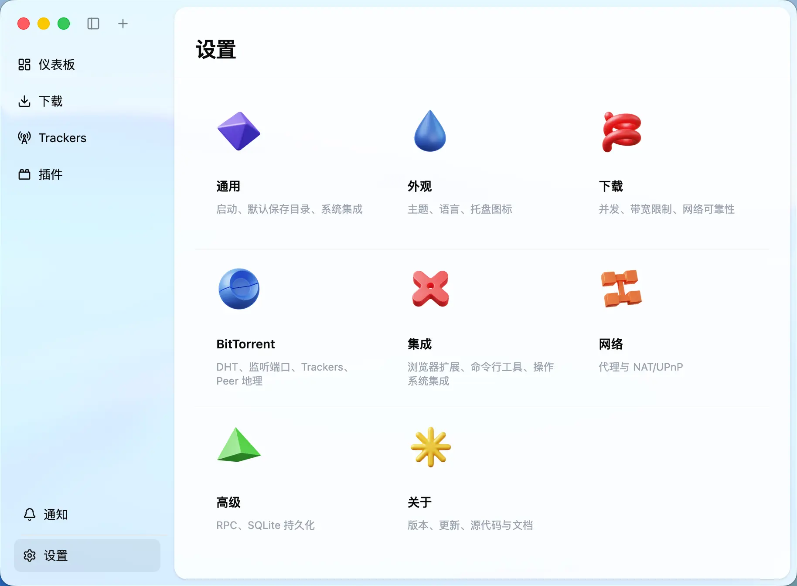

<div>
  
  <h1>Motrix</h1>
  <p>简洁易用、功能丰富的现代下载管理器</p>
</div>

[](https://github.com/agalwood/Motrix/releases)  

[English](./README.md) | 简体中文

## 简介

Motrix 是一款界面简洁、功能丰富的桌面下载管理器，可处理 HTTP、FTP、BitTorrent 和磁力链接（Magnet）等多种下载任务。

**Motrix Turbo** 是 Motrix 的 v2 版本。它保留了 v1 简洁易用的特点，并使用 Electron、React 和 TypeScript 重新开发。下载内核与界面相互独立；浏览器扩展和命令行工具通过开放协议 **MDXP**（Motrix Download eXchange Protocol，采用 JSON-RPC 2.0）与应用通信，插件则在独立的沙箱中运行。

同一套内核既可用于桌面应用，也可作为 Headless server 运行：

- **桌面应用**：可在 macOS、Windows 和 Linux 上运行；
- **Headless server**：无需桌面环境，可直接使用 Node.js 运行或通过 Docker 部署，并提供 Web 界面，适合安装在 NAS 和家庭服务器上。

## 🧪 Beta 测试

Motrix Turbo v2 目前仍处于 beta 阶段。剩余发布门禁通过后，请从 GitHub Releases
下载 [v2.0.0-beta.28](https://github.com/agalwood/Motrix/releases/tag/v2.0.0-beta.28)，
并在安装前阅读[完整发布说明](./docs/release-notes/2.0.0-beta.28.zh-CN.md)。

测试前请备份现有 Motrix 数据和下载文件。Motrix v1 数据的迁移路径尚未经过
验证，请勿让本 beta 使用您唯一一份 v1 数据。条件允许时，建议通过独立的系统
账户、设备或 Docker 数据目录与现有环境并行测试 v2。

## 应用截图

### 仪表盘

<picture>
  <source media="(prefers-color-scheme: dark)" srcset="./screenshots/motrix-dashboard-cn-dark.webp">
  <source media="(prefers-color-scheme: light)" srcset="./screenshots/motrix-dashboard-cn.webp">
  
</picture>

### 下载任务

<picture>
  <source media="(prefers-color-scheme: dark)" srcset="./screenshots/motrix-downloads-cn-dark.webp">
  <source media="(prefers-color-scheme: light)" srcset="./screenshots/motrix-downloads-cn.webp">
  
</picture>

### 设置

<picture>
  <source media="(prefers-color-scheme: dark)" srcset="./screenshots/motrix-settings-cn-dark.webp">
  <source media="(prefers-color-scheme: light)" srcset="./screenshots/motrix-settings-cn.webp">
  
</picture>

## ✨ 主要功能

- 🕹 简洁直观的图形界面，支持深色模式
- 🦄 支持 BT 和磁力链接任务，可按需选择种子中的文件
- 📡 内置 Tracker 列表，可自动更新并检查可用性
- 🔌 支持 UPnP 和 NAT-PMP 端口映射
- 🚥 可限制上传和下载速度，并在多档限速模式之间切换
- 💾 下载会话保存在 SQLite 中，重启应用后可自动恢复任务
- 📊 Dashboard 支持自定义布局，可展示传输统计、实时活动和任务磁贴
- 🔔 下载完成时发送系统通知，应用内也可集中查看通知
- 🧩 插件采用 QuickJS 沙箱隔离和细粒度能力授权，并可直接从应用内插件市场安装
- 🌐 Chrome 和 Firefox 扩展可一键将浏览器下载任务交给 Motrix
- ⌨️ 官方命令行客户端 `@motrix/cli` 既适合日常操作，也可供 AI agent 调用
- 🐳 Headless server 可通过 Docker 部署，远程 CLI 和 agent 可使用 device-code 安全配对
- 🎬 URL Resolver 插件可解析站点媒体页面，并可扩展对更多站点的支持
- 🤖 可驻留系统托盘，并支持开机自启动
- 🌍 界面支持简体中文和英语，后续将加入更多语言
- 🔗 注册 `motrix://` 和 `magnet:` 协议处理程序，并关联 `.torrent` 文件

## 🧩 周边生态

除了桌面应用，Motrix 还提供协议库、命令行客户端、浏览器扩展和插件开发工具。这些项目与应用本身共同组成 Motrix 生态：

| 项目 | 形式 | 说明 |
|------|------|------|
| [`@motrix/mdxp`](https://github.com/motrixapp/mdxp) | npm 包 | 集中定义 MDXP 的 JSON-RPC 2.0 wire schema 和 Zod 类型，并提供双向连接工具，让通信两端使用同一套协议 |
| [`@motrix/cli`](https://github.com/motrixapp/cli) | npm 包 | 命令行客户端，可执行命令为 `motrix`。它能自动发现并控制本地桌面应用，也能与远程实例配对 |
| Motrix Browser Extension | 浏览器扩展 | 面向 Chrome 和 Firefox 的 MV3 扩展，可接管浏览器下载任务，并通过 native messaging 与桌面应用安全配对 |
| [Motrix Plugin SDK](https://github.com/motrixapp/plugin-sdk) | 4 个 npm 包 | 包括 `@motrix/plugin-manifest-schema`、`@motrix/plugin-api`、`@motrix/plugin-cli` 和 `create-motrix-plugin`，提供插件开发、调试和打包所需的工具 |
| [Builtin Plugins](https://github.com/motrixapp/builtin-plugins) | 已签名的 `.moext` | 官方提供三个内置插件：**Filename Template**（保存文件时按模板自动重命名）、**Page Scraper**（从 HTML 页面提取实际文件链接）和 **URL Resolver**（为站点媒体解析提供基础能力） |
| Plugin Registry | 公共数据源 | 维护插件列表和安装信息，并生成 `dl.motrix.app/registry/plugins.json`，供官网插件目录和应用内插件市场使用 |

### CLI 快速上手

```bash
npm install -g @motrix/cli    # 需要 Node.js >= 22

motrix add https://example.com/file.iso --save-dir ~/Downloads
motrix list                   # 查看任务列表
motrix watch --stats          # 以 NDJSON 流式输出实时进度
motrix pair --name my-nas     # 通过 device-code 配对远程或 headless 实例
```

### 编写插件

[Motrix Plugin SDK](https://github.com/motrixapp/plugin-sdk) 提供 TypeScript API、manifest schema、项目脚手架和 CLI，覆盖完整的插件开发流程：

```bash
pnpm create motrix-plugin my-plugin
cd my-plugin && pnpm install
pnpm dev                         # 监听构建，并启动 Motrix 加载插件
pnpm exec motrix-plugin validate # 校验 motrix-plugin.json
pnpm run pack                    # 生成 dist/<id>-<version>.moext
pnpm exec motrix-plugin lint     # 检查打包产物
```

默认脚手架会创建一个使用 `beforeCreate` 的 URL Resolver；在项目名后添加 `post-action`，则会创建一个使用 `afterComplete` 发送通知的插件。插件可以接入 `beforeCreate`、`beforeFinalize`、`afterComplete` 和 `onError` 等生命周期钩子，也可以提供可调用的命令和设置，并通过 `motrix:plugin-api` 虚拟模块访问运行时 API。

插件会打包为单个 ES2020 模块，并在 QuickJS 沙箱中运行，不能使用 Node.js API，也不能直接访问文件或网络。请在 `motrix-plugin.json` 中声明激活事件、所需能力以及限定 URL 范围的宿主权限；Motrix 会在授权前向用户展示这些请求。项目模板、manifest 与运行时 API 参考、本地化、沙箱约束、打包和分发方式请参阅 [Plugin SDK 文档](https://github.com/motrixapp/plugin-sdk)。

## 📦 安装

### 桌面应用

访问 Motrix 官网 [motrix.app](https://motrix.app)，选择对应操作系统的安装包。macOS 用户通常下载 Apple Silicon 版本即可；如果使用较早的 Intel 芯片 Mac，请选择 Intel 版本。

剩余发布门禁通过后，当前 beta 桌面安装包将通过上方链接的 GitHub 预发布版
提供。受保护的发布 tag 也会把验证过的 Snap 构建发布到
`latest/edge`。请根据操作系统和架构选择安装包：

| 平台 | 架构 | 安装包 / 通道 | 选择建议 |
|------|------|---------------|----------|
| macOS 12+ | `arm64`（Apple Silicon）、`x64`（Intel） | `.dmg` / `.zip` | 选择与 Mac 架构匹配的 `.dmg`；仅 Intel Mac 使用 `x64` |
| Windows | `x64` | `.exe`（NSIS 安装包）/ `.zip` | 常规安装使用 `.exe`；`.zip` 可解压后手动运行 |
| Linux | `x64`、`arm64` | `.AppImage` / `.deb` / `.rpm` | 任意发行版可使用便携的 `.AppImage`，Debian 或 Ubuntu 使用 `.deb`，Fedora 或 openSUSE 使用 `.rpm` |
| Linux（Snap Store） | `amd64`、`arm64` | `latest/edge` | 使用 `sudo snap install motrix --edge` 安装严格限制的 beta |

`.AppImage` 首次启动时会询问是否把桌面入口和 URL scheme 处理程序注册到你的用户数据目录；拒绝则不改动系统。之后随时可以在「设置 → 集成」中启用或移除该桌面集成。
Snap Store 安装包使用严格限制。已批准的 `personal-files` interface 允许 Motrix
为支持的浏览器注册 Native Messaging host，不会授予常规 Snap interface
之外的通用文件访问权限。Flatpak 会单独验证，不会随该版本 tag 发布。
同时不提供 Windows `arm64` 和任何 32 位安装包。Windows `x64` 安装包未签名，
可能触发 Windows SmartScreen 警告。

### 命令行客户端

```bash
npm install -g @motrix/cli
```

也可以在桌面应用的 Settings → Integration → Command-line tools 中一键安装。

### Headless server（Docker）

带 tag 的版本会把多架构 Server 镜像发布到 Docker Hub 和 GHCR。
Beta 只发布不可变的版本 tag，不会更新 `latest`；仓库的 `compose.yaml`
会分别持久化 Server 状态与用户下载资源：

```bash
mkdir -p motrix-data downloads
sudo chown 1000:1000 motrix-data downloads
export MOTRIX_IMAGE='docker.io/motrixapp/motrix-server:2.0.0-beta.28'
export MOTRIX_PUBLIC_URL='http://nas.example.lan:8080'
docker compose pull server
docker compose up -d --wait
```

runtime 以非 root 用户运行，支持只读根文件系统，在接受任务前检查挂载权限，
并在替换容器后保留下载、session 和已安装插件。标准的直连 LAN 部署会把 Web
服务发布到 8080 端口，把 MDXP 发布到 16801 端口。请将
`MOTRIX_PUBLIC_URL` 设为远程客户端实际可访问的 Web 审批 URL；Compose 文件不会
为它填入会误导远程客户端的 localhost URL。

如果 Web 审批 URL 暂时不可用，SSH operator 无需开放额外端口即可列出请求，
并批准客户端显示的指定验证码：

```bash
docker compose exec server motrix-admin pairing pending
docker compose exec server motrix-admin pairing approve ABCD-EFGH
```

远程 CLI 和 agent 客户端通过 device-code flow 配对。设置
`MOTRIX_REMOTE_EXTENSION_ENABLED=true`，并把扩展中要填写的 WS/WSS 地址设为
`MOTRIX_REMOTE_EXTENSION_PUBLIC_URL` 后，浏览器扩展也可以与 headless Server 配对。
operator 默认仍要求 HTTPS；可信局域网若要直接使用 HTTP，还必须显式设置
`MOTRIX_ALLOW_INSECURE_OPERATOR_HTTP=true`，启动日志会持续提示风险。公网或不可信
LAN 绝不能开启该选项，必须配置 TLS 反向代理，并用防火墙保护源端口。
Docker Hub/GHCR 镜像与 tag 选择、群晖
DSM 7 和飞牛 fnOS 安装、目录所有权、端口、诊断与备份/升级说明见
[Docker Server 部署指南](./docs/docker-server.zh-CN.md)。

## 🛠 开发与构建

开发前请先安装 Node.js 22+ 和 pnpm。pnpm 版本以 `package.json` 中的 `packageManager` 字段为准。

```bash
git clone https://github.com/agalwood/Motrix.git
cd Motrix

pnpm install     # 安装依赖（postinstall 自动下载适用于本机系统的 aria2，并重建原生模块）
pnpm start       # 启动 Electron 开发模式（renderer 使用 Vite HMR）

pnpm test        # Vitest 单元测试
pnpm test:e2e    # Playwright E2E 测试
pnpm run lint    # biome check .

pnpm build       # 下载已签名的内置插件，并构建 native host 和 4 个 Vite target
```

### 在 macOS 预览窗口内应用菜单

Windows 和 Linux 会在 Motrix 窗口内渲染应用菜单。在 macOS 开发环境中，可以通过
以下预览开关检查相同的窗口布局：

```bash
MOTRIX_PREVIEW_MAC_MENU=1 pnpm start
```

该开关会隐藏主窗口的 macOS 红绿灯按钮，启用 renderer dropdown menu，并显示
Windows/Linux 使用的自绘窗体按钮。可在这个模式下收起 Sidebar，联合检查应用菜单、
附加 actions、拖拽区域和窗体按钮的安全间距。Electron 和 Vite 都会在启动时读取此
开关，因此修改后需要重启开发进程。

此模式用于调试布局和 command 菜单项。Electron 会通过 AppKit 原生菜单处理 macOS
role 菜单项，因此 **Window → Minimize** 等 role action 从预览 dropdown 调用时，行为
不会与原生菜单完全一致；这些原生 role action 需要在 Windows 或 Linux 上验收。

macOS、Windows 和 Linux 的打包命令（`pack:*` / `dist:*`）可以在 `package.json` 的 scripts 字段和 `electron-builder.json` 中查看。

## 🔧 技术栈

| 领域 | 选型 |
|------|------|
| 桌面 shell | Electron 43 |
| 界面 | React 19 + Tailwind CSS 4 + shadcn/ui |
| 语言 | TypeScript（strict mode） |
| 构建 | Vite 8（main / preload / worker / renderer，4 个 target） |
| 数据校验 | Zod 4（在运行时校验 settings、IPC payload 和 wire schema） |
| 下载引擎 | 使用 Motrix 维护的 [aria2 fork](https://github.com/motrixapp/aria2)，随应用分发 |
| 持久化 | better-sqlite3（保存并恢复任务会话） |
| 插件沙箱 | quickjs-emscripten |
| 服务端 shell | Node.js + Fastify + WebSocket |
| 国际化 | i18next + react-i18next |
| 质量工具 | Biome、Vitest、Playwright |

项目采用四层架构。CI 会检查各层之间的依赖，确保边界清晰，也方便日后将 core 改写为 Rust：

```
renderer（React 界面）
   │  IPC（window.motrix）
core（与下载引擎无关的应用内核，包括任务、设置、插件和 bridge）
   │  engine adapter
aria2（下载引擎）
```

Electron 桌面应用和 Node headless 服务端共用同一个 core。通知、secret 存储等功能在两种环境中各有对应实现，但使用方式保持一致。

## 🤝 参与贡献

我们欢迎代码、测试、文档、翻译、Issue 反馈和设计建议等各种形式的贡献。创建 Pull Request 前，请阅读[贡献指南](./CONTRIBUTING.zh-CN.md)，了解开发流程、架构边界、实现规范和必要的验证要求。

所有参与者都必须遵守[行为准则](./CODE_OF_CONDUCT.zh-CN.md)。如需报告疑似安全漏洞，请按照[安全策略](./SECURITY.zh-CN.md)私密提交，不要创建公开 Issue 或 Discussion。

## 📜 许可协议

[MIT](./LICENSE) © 2018-present Dr_rOot

第三方组件许可信息见 [`THIRD_PARTY_NOTICES.zh-CN.md`](./THIRD_PARTY_NOTICES.zh-CN.md)。
正式安装包还会在 `legal/` 目录中提供自动生成的依赖清单、许可证全文汇总和 SPDX 2.3 SBOM。
