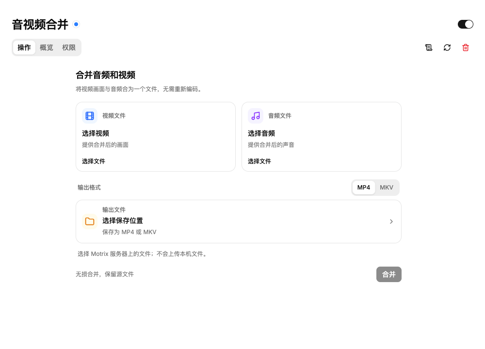

# 手动合并音频和视频

此功能需要包含手动媒体合并界面的 Motrix 版本，以及已启用的音视频合并插件。
仅在旧版本中安装插件，不会增加操作界面。

官方插件 ID 为 `motrix.media-merge`，源码由
[builtin-plugins](https://github.com/motrixapp/builtin-plugins) 维护。
插件需要单独安装，不属于 Motrix 默认打包内容。
[插件目录](https://motrix.app/zh/plugins/motrix.media-merge/)提供兼容版本和安装包状态；
通过目录安装需要先发布正式签名包。

插件要求 `Motrix >=2.0.0-beta.47 <3.0.0`。旧版宿主会显示所需版本范围和当前版本，
并在权限确认前阻止安装。

先在 **设置 → 集成 → 媒体工具** 中配置 FFmpeg，待官方签名包上线后从插件市场安装。
详见[官方可选插件](official-optional-plugins.zh-CN.md)。插件需要 `ffmpeg` 权限。
如果在插件启用后才配置 FFmpeg，请停用再启用插件，
以刷新能力状态。

支持两种入口：

1. 选中两个已完成的单文件下载任务，在任务操作菜单中选择 **合并音频和视频**。
   窗口会预填两个文件的路径。
2. 打开已安装的音视频合并插件详情，在 **操作** 页直接选择本地视频、音频文件
   及输出文件名。



操作页和任务菜单弹窗共用一套表单。切换 Tab 会保留已选文件和进度；离开后返回页面
会恢复当前窗口的草稿，并刷新最近一次合并状态。成功后点击 **再次合并**，会
保留输入文件并清空输出位置，方便填写新文件名。草稿不会在应用重启后保留。

在任一入口中，桌面端可拖入一个视频和一个音频文件，也可点击卡片打开文件选择器。
卡片显示文件名，悬停可查看完整路径。选择 **MP4** 或 **MKV** 后，输出文件的扩展名
会同步更新；先选格式再选视频时，也会自动建议对应格式的文件名。格式选择随草稿保留。
确认保存位置和新文件名后点击 **合并**。
支持仅含音轨的 MP4 文件。配套插件会检查媒体轨道，在输入顺序明确反转时自动交换。
如果两个文件都包含音轨和视频轨，则使用“视频文件”的第一条视频轨，以及“音频文件”
的第一条音轨。

插件直接复制编码后的媒体轨道，不重新编码。此功能不进行片段首尾拼接，也不校准
起始时间不同的录制文件或调整音画同步。MP4 无法容纳所有编码；合并失败时可尝试 MKV。

请选择独立的媒体文件：MP4/MOV、MKV/WebM、AVI、MPEG/TS、FLV、AAC、MP3、FLAC、
Ogg 或 WAV。不支持 HLS/DASH 播放列表、concat 脚本或图片序列，即使它们引用的也是
本地文件。宿主在探测和合并前限制输入解析器，避免选中文件内部的引用间接获得其他
文件的读取权限。修改播放列表的后缀不会使它成为可合并的视频文件。

源文件始终保留。不会覆盖已有输出文件，包括合并期间新出现的同名文件。输出先写入
目标目录旁的临时目录，在成功、失败或取消后清理。最终保存使用原子且不覆盖的硬链接，
因此目标文件系统需要支持硬链接。保存失败会保留源文件并显示错误。进程意外终止时
可能留下 `.motrix-merge-*` 临时目录，确认没有合并操作正在运行后才可删除。

每个宿主同时运行一个手动合并任务。窗口提供进度和 **取消** 操作，执行时限为一小时。
应用重启后不会恢复合并任务。合并文件会保存到指定位置，不会作为新的下载任务加入列表。

两端复用现有的路径选择组件。桌面端打开原生文件对话框；Web UI 复用服务器目录浏览器，
保留导航、收藏、隐藏文件和排序功能。选择输入文件后，在保存对话框中选择输出文件夹，
填写新文件名；已有文件不会被覆盖。浏览器操作的是 Motrix 服务器上的文件，不会上传本机文件。
服务器下载目录策略同样约束浏览、输入选择和输出；选择文件和开始合并时都会重新验证路径。

合并日志可从插件详情页右上角的 **日志** 按钮查看。宿主记录开始、取消请求、
完成、取消和失败，并附带任务编号、文件名、输出格式和耗时。失败日志还包含
处理阶段与原因；文件检查和最终保存失败也会记录。只有输出成功保存后才会记录完成。
这些记录同时写入现有插件日志文件，桌面端和 Server 行为一致。默认仅记录文件名；
日志页的详细模式可保留完整路径。进度更新不会逐条写入日志。

## 插件命令约定

测试版期间新增的能力，应在 `engines.motrix` 中明确声明首次包含该能力的 beta
版本。例如，`>=2.0.0-beta.45` 会拒绝 beta.44，接受 beta.45 及后续 beta，也接受
`2.0.0` 正式版。范围中只要包含测试版编号，就会按完整 SemVer 优先级比较。
仅含正式版本号的范围保留现有的宿主 API 版本兼容规则，因此 `>=2.0.0 <3.0.0`
仍允许 2.0.0 beta 宿主；插件依赖较新 beta 的能力时，应明确写出最低 beta 版本。

插件通过申请必需的 `ffmpeg` 权限，并声明名为 `<plugin-id>.mergeStreams` 的公开命令
来接入此界面。命令需同时声明参数和结果 schema。拖拽和格式选择属于宿主界面能力。此约定复用现有 manifest schema，
不新增 manifest 字段，也不提供通用命令控制台。

`.mergeStreams` 命令名保留给宿主授权的手动合并任务。`public` 标记用于发现提供此功能的
插件，不允许其他插件借此执行合并。跨插件调用和通用命令调用都会在插件执行前被拒绝，
请始终通过手动合并界面调用。

宿主传入 `{ videoInput, audioInput, output }`，三个字段均为绝对路径。`output` 是宿主
分配的临时路径，扩展名与用户选择一致。命令应在 FFmpeg 操作成功后返回
`{ outputPath: output }`。
顶层相对路径会被拒绝，不会按照进程工作目录补全。宿主先解析符号链接，再应用服务器
目录策略。播放列表内部的相对引用通常以播放列表所在目录为基准，但此类输入整体不受
支持，不会继承选中文件的授权。

```ts
commands.register('example.media-merge.mergeStreams', async (args) => {
  const operation = await ffmpeg.mergeStreams(args)
  await operation.result
  return { outputPath: args.output }
})
```

启动调用和 `operation.result` 都需要等待：当前 QuickJS 桥接会异步返回操作句柄。
宿主根据 manifest 验证命令参数和结果，在插件的 FIFO 队列中运行命令，并等待相关进程
停止后才结束任务。在此次调用中，FFmpeg 只能探测选中的两个路径，并向预留的输出路径
启动一次合并。其他 FFmpeg 操作和嵌套插件命令会被拒绝，输入协议和解析器限定为独立的
本地媒体文件。探测被取消或超时时，会终止子进程，并等待进程退出后才释放任务。
进度和取消由宿主管理，插件不需要自行轮询。
