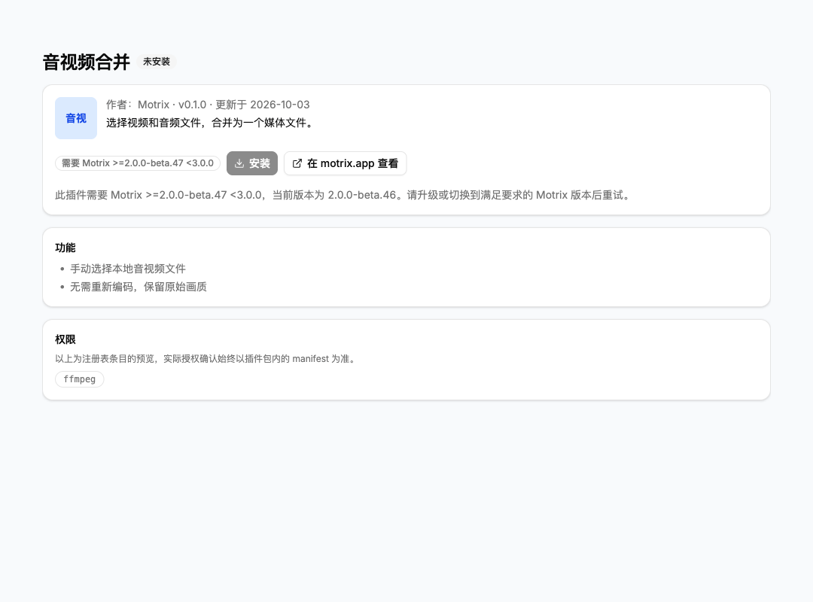

# Official optional plugins

Official optional plugins are installed from the plugin marketplace. Choose a
plugin, select **Install**, review its permissions, then confirm. Optional
permissions remain off until granted. Installed plugins can be disabled,
updated, or uninstalled from their detail page in both the desktop and server
applications.

Motrix displays **Official Motrix signature verified** only after checking the
complete package against its pinned official signing keys. Marketplace labels
alone do not establish this identity. Package size, SHA-256, manifest identity,
version, engine requirements, and declared permissions must also match the
marketplace entry.

The app retains the signed archive and checks it again during discovery and
before execution. Trusted manifests and executable code are read from that
archive, not the extracted files. An invalid signature prevents loading.

Official optional plugins use the same permission confirmation, optional grants,
and upgrade consent as community plugins. Official signing allows the
`motrix.*` namespace but does not grant built-in-only hook roles such as
`pre-resolve`. Plugins bundled with the app continue to use the separate signed
built-in update channel and cannot be replaced through optional installation.

## Host compatibility

`motrix.media-merge` is an official optional plugin. Its current manifest requires
`>=2.0.0-beta.47 <3.0.0`: beta.46 is rejected; beta.47, later 2.0 betas, and
compatible 2.x releases are accepted; 3.0.0 is rejected. Configure FFmpeg before
installing it and review the required `ffmpeg` permission.

An incompatible marketplace entry remains visible with installation disabled.
Its detail page shows the full required range and the current host version,
with guidance to upgrade or switch to a compatible version. The host checks the
registry requirement before downloading, then independently checks the package
manifest before requesting consent. Package imports also return the requirement
and current version when manifest compatibility fails. Both desktop and server
use the same localized message. No plugin is installed and no grants are saved
on this failure. A range with an upper bound must not be shortened to “version+”.

The screenshots below use local UI fixtures to illustrate the actual components;
they do not indicate that a package has been published to the live marketplace.

## Publishing requirements

The registry v2 format is unchanged. An optional official entry supplies a
package URL, size, SHA-256, and an Ed25519 `package.signature` over the exact
`.moext` bytes, using a key trusted by the app. Both existing registry origins
remain supported: identity is established by signature verification. An entry
marked `builtin` must have a valid official signature to enter optional
installation when it is not bundled with the app.

The manifest must support non-bundled execution. In particular, the retired
`motrix.scraper-hook` 1.0.0 package uses `pre-resolve` and remains unavailable for
optional installation. Publish and list the revised `enrich` implementation
before offering it again. Updating the app alone does not publish that package.
Unsigned local files or arbitrary download URLs cannot claim official identity;
this installation channel obtains the detached signature from the registry.
